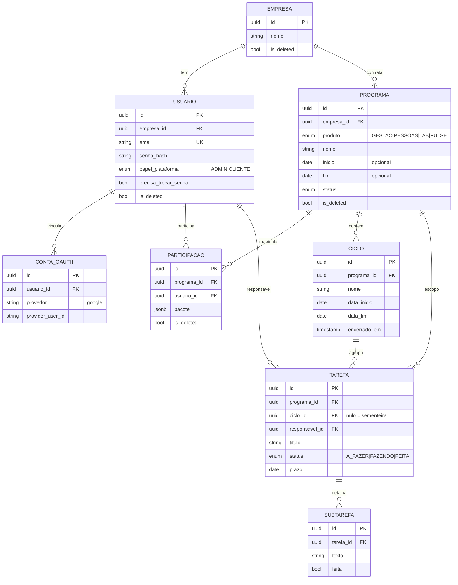

# Modelo de banco

O **modelo-alvo** de dados em Postgres (via Prisma), projeção do
[modelo de domínio](arquitetura-dominio.md) em tabelas. Hoje o `schema.prisma` só tem cinco
tabelas (`empresas`, `usuarios`, `ciclos`, `tarefas`, `subtarefas`); este é o desenho para
onde ele evolui, com a **proposta de migrations** ao final.

!!! note "Escopo e soft delete em toda tabela"
    Toda tabela de dados de programa carrega as colunas de escopo (`empresa_id` e/ou
    `programa_id`) usadas pelo filtro multi-tenant ([RNF-2](requisitos.md#rnf-2)) e as
    colunas de soft delete `is_deleted` + `excluido_em` ([RNF-9](requisitos.md#rnf-9)).
    Omitidas nos diagramas por brevidade, exceto onde ajudam a leitura.

## Núcleo: identidade, tenancy e tarefas

## Motores: formulários, agenda, jornada, selos, comunicação, diagnóstico, presença

```mermaid
erDiagram
    FORMULARIO ||--o{ CAMPO : possui
    FORMULARIO ||--o{ ATRIBUICAO_FORMULARIO : atribui
    ATRIBUICAO_FORMULARIO ||--o{ RESPOSTA_FORMULARIO : coleta
    RESPOSTA_FORMULARIO ||--o{ RESPOSTA_CAMPO : contem
    CAMPO ||--o{ RESPOSTA_CAMPO : responde

    PROGRAMA ||--o{ DISPONIBILIDADE : publica
    DISPONIBILIDADE ||--o{ SLOT : abre
    SLOT ||--o| SESSAO : agenda
    SESSAO ||--o| REGISTRO_SESSAO : registra

    TRILHA ||--o{ ITEM_TRILHA : ordena
    ITEM_TRILHA ||--o{ PROGRESSO_ITEM : progride
    MIDIA ||--o{ ITEM_TRILHA : referencia

    JORNADA ||--o{ ETAPA : ordena
    ETAPA ||--o{ PROGRESSO_ETAPA : progride
    SELO ||--|| CRITERIO_SELO : define
    SELO ||--o{ SELO_CONCEDIDO : concede

    MODELO_MENSAGEM ||--o{ DISPARO : gera

    DIAGNOSTICO ||--o{ DIMENSAO : agrupa
    DIAGNOSTICO ||--o{ RESULTADO_DIAGNOSTICO : calcula
    RESULTADO_DIAGNOSTICO ||--o| PLANO_ACAO : origina
    PLANO_ACAO ||--o{ TAREFA : itens

    EVENTO ||--o{ CHECKIN_PRESENCA : registra
    PARTICIPACAO ||--o{ CERTIFICADO : emite
    MIDIA ||--o{ CERTIFICADO : pdf

    FORMULARIO {
        uuid id PK
        uuid programa_id FK "definição pode ser global"
        string titulo
        bool avaliado
    }
    CAMPO {
        uuid id PK
        uuid formulario_id FK
        enum tipo
        string rotulo
        bool obrigatorio
        int ordem
        jsonb opcoes
        jsonb gabarito "quiz"
        int pontuacao "quiz"
    }
    ATRIBUICAO_FORMULARIO {
        uuid id PK
        uuid formulario_id FK
        enum contexto "PROGRAMA|ETAPA|PARTICIPACAO"
        uuid contexto_id
        date prazo
    }
    RESPOSTA_FORMULARIO {
        uuid id PK
        uuid atribuicao_id FK
        uuid participacao_id FK
        enum status "RASCUNHO|ENVIADA"
        timestamp enviada_em
        int pontuacao_total
    }
    RESPOSTA_CAMPO {
        uuid id PK
        uuid resposta_id FK
        uuid campo_id FK
        jsonb valor
    }
    DISPONIBILIDADE {
        uuid id PK
        uuid programa_id FK
        timestamp inicio
        timestamp fim
    }
    SLOT {
        uuid id PK
        uuid disponibilidade_id FK
        timestamp inicio
        enum status "LIVRE|OCUPADO"
    }
    SESSAO {
        uuid id PK
        uuid slot_id FK
        uuid participacao_id FK
        uuid mentor_id FK "Usuario ADMIN"
        enum status "AGENDADA|REALIZADA|TRANSFERIDA"
        bool check_in
    }
    REGISTRO_SESSAO {
        uuid id PK
        uuid sessao_id FK
        string combinado
        string fez_mais
        string fez_menos
    }
    TRILHA {
        uuid id PK
        string titulo
    }
    ITEM_TRILHA {
        uuid id PK
        uuid trilha_id FK
        uuid midia_id FK
        enum tipo "PILULA|VIDEO|LEITURA|QUIZ"
        int ordem
    }
    PROGRESSO_ITEM {
        uuid id PK
        uuid item_id FK
        uuid participacao_id FK
        bool concluido
    }
    JORNADA {
        uuid id PK
        string titulo
    }
    ETAPA {
        uuid id PK
        uuid jornada_id FK
        uuid formulario_id FK
        uuid trilha_id FK
        uuid selo_id FK
        enum tipo "MARCO|ENCONTRO|FORMATURA"
        int ordem
        int offset_dias
    }
    PROGRESSO_ETAPA {
        uuid id PK
        uuid etapa_id FK
        uuid participacao_id FK
        bool concluida
    }
    SELO {
        uuid id PK
        string nome
        string pilar
    }
    CRITERIO_SELO {
        uuid id PK
        uuid selo_id FK
        enum tipo "ETAPA|TRILHA|PRESENCA"
        uuid alvo_id
    }
    SELO_CONCEDIDO {
        uuid id PK
        uuid selo_id FK
        uuid participacao_id FK
        timestamp concedido_em
    }
    MODELO_MENSAGEM {
        uuid id PK
        uuid programa_id FK
        string gatilho
        string corpo
    }
    DISPARO {
        uuid id PK
        uuid modelo_id FK
        uuid participacao_id FK
        timestamp agendado_para
        enum status "AGENDADO|ENVIADO|FALHOU"
    }
    DIAGNOSTICO {
        uuid id PK
        uuid formulario_id FK
        string titulo
    }
    DIMENSAO {
        uuid id PK
        uuid diagnostico_id FK
        string nome
    }
    RESULTADO_DIAGNOSTICO {
        uuid id PK
        uuid diagnostico_id FK
        uuid participacao_id FK
        jsonb maturidade_por_dimensao
        float maturidade_geral
    }
    PLANO_ACAO {
        uuid id PK
        uuid resultado_id FK
    }
    EVENTO {
        uuid id PK
        uuid programa_id FK
        string nome
        int carga_horaria
    }
    CHECKIN_PRESENCA {
        uuid id PK
        uuid evento_id FK
        uuid participacao_id FK
        timestamp registrado_em
    }
    CERTIFICADO {
        uuid id PK
        uuid participacao_id FK
        uuid midia_id FK
        timestamp emitido_em
    }
    MIDIA {
        uuid id PK
        string chave_s3
        string tipo
    }
```

## Proposta de migrations

O schema atual evolui em ondas, acompanhando as fases do ROADMAP — nada é jogado fora, o
modelo de dados é reaproveitado ([RC-2](requisitos.md#rc-2)).

1. **Identidade e escopo (E1).** Criar `produtos` (enum), `programas`, `participacoes` e
   `contas_oauth`. Ligar `programas` a `empresas`. Base do filtro multi-tenant por
   `programa_id` — [RF-E1.1](requisitos.md#rf-e1-1)..[RF-E1.3](requisitos.md#rf-e1-3).
2. **Repontar tarefas (E3).** Adicionar `programa_id` a `ciclos` e `tarefas` (hoje apontam
   para `empresa_id`); migrar os dados existentes para um Programa "Gestão" default por
   empresa; depois tornar `programa_id` obrigatório — [RF-E3.1](requisitos.md#rf-e3-1).
3. **Soft delete global (RNF-9).** Adicionar `is_deleted` + `excluido_em` a todas as tabelas
   de agregado e ajustar consultas para filtrá-las por padrão —
   [RNF-9](requisitos.md#rnf-9).
4. **Motores, por fase.** Criar as tabelas de cada motor quando a fase o puxar: formulários
   (E4), agenda (E5), conteúdo (E6), jornada (E7), selos (E8), comunicação (E9), diagnóstico
   (E10) e presença (E11) — cada motor nasce pequeno.

!!! tip "Anti-staleness"
    Quando o `schema.prisma` crescer para o modelo-alvo (na migração para a API/monorepo do
    M13), vale gerar este ERD automaticamente a partir do schema (ex.: `prisma-erd-generator`
    ou `prisma-markdown`), substituindo o diagrama-alvo mantido à mão por um gerado do código.
    Enquanto o schema real tem só cinco tabelas, o modelo-alvo acima é mantido como desenho.
