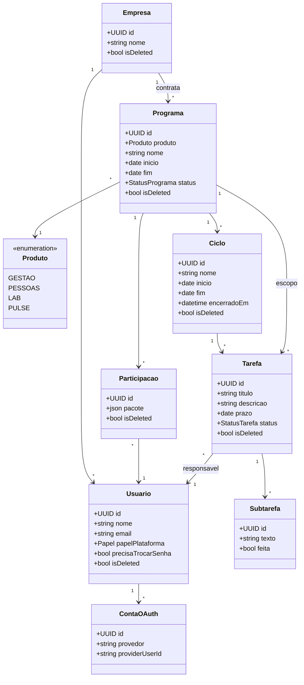
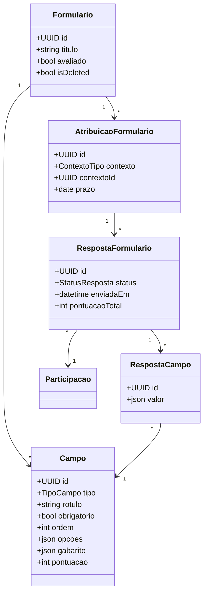
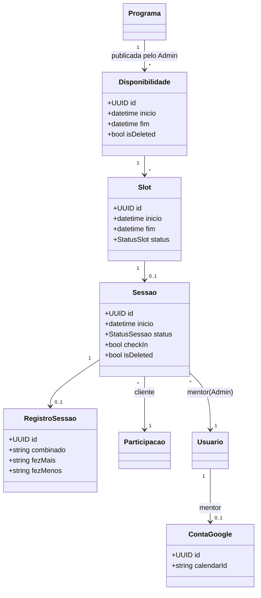
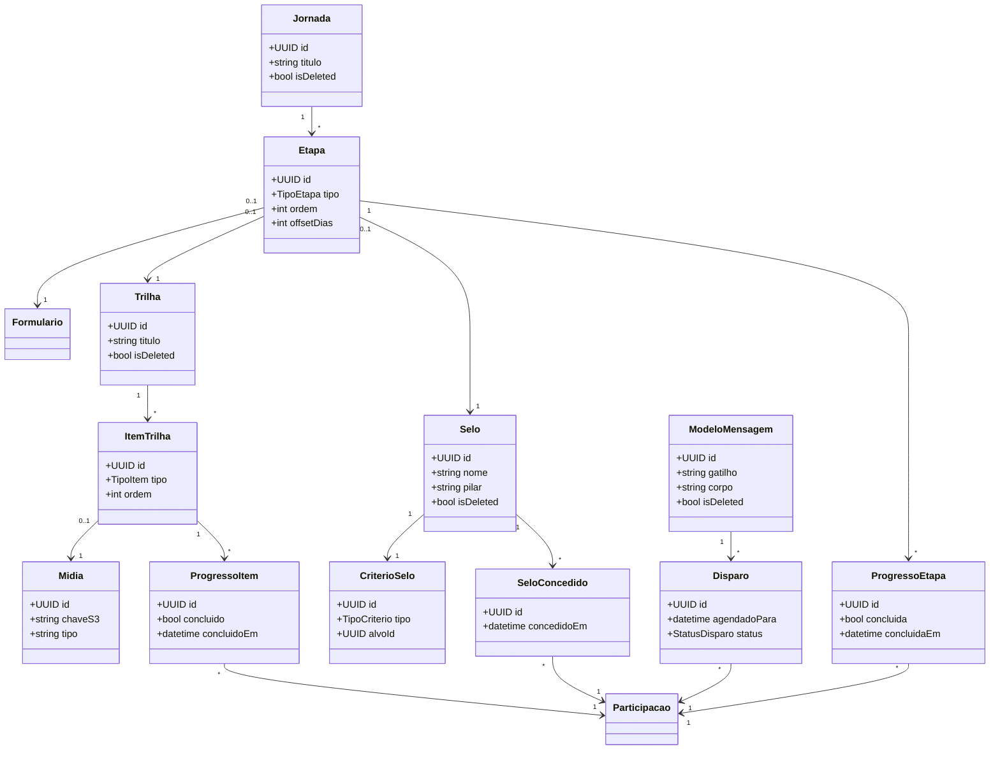
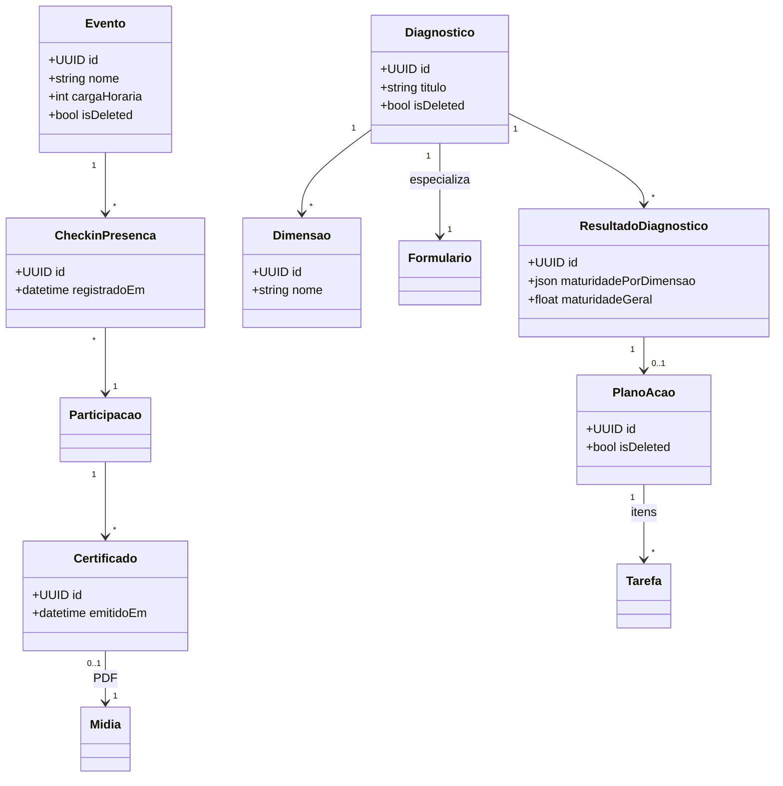

# Modelo de domínio

As classes do domínio Nuree, organizadas por motor. É a arquitetura ideal descrita nos
[requisitos](requisitos.md) — o [modelo de banco](arquitetura-banco.md) é a sua projeção
em tabelas, e os [módulos da API](arquitetura-modulos.md) são o seu recorte em bounded contexts.

## O padrão que se repete: definição → aplicação → resposta

Quase todos os motores (formulários, jornadas, trilhas, selos, réguas, templates de ciclo)
seguem **três camadas** — e é isso que dá ao admin o poder de configurar sem depender do dev
([RNF-1](requisitos.md#rnf-1)):

1. **Definição / Template** — o admin cria no construtor, reutilizável (`Formulario`,
   `Jornada`, `Trilha`, `Selo`, `ModeloMensagem`, `TemplateCiclo`).
2. **Aplicação / Atribuição** — a definição é anexada a um contexto (`Programa`, `Etapa`,
   `Participacao`).
3. **Instância / Resposta / Progresso** — o dado real do cliente (`RespostaFormulario`,
   `ProgressoEtapa`, `SeloConcedido`).

Adicionar "mais um formulário" ou "mais uma trilha" é **criar dado**, não escrever código.

!!! info "Soft delete global"
    Todo agregado carrega `isDeleted` + `excluidoEm` ([RNF-9](requisitos.md#rnf-9)): a
    exclusão marca o registro (some da UI) e o hard delete só ocorre após ~3 meses. Nos
    diagramas abaixo o campo aparece nas raízes de agregado; presuma-o nas demais.

## Núcleo de identidade, tenancy e tarefas

`Produto` é um catálogo fixo (enum); `Programa` é a instância concreta de um produto para
uma empresa e o **container** de tudo; `Participacao` matricula um `Usuario` num `Programa`
com o **pacote contratado** — sem papel próprio, já que os únicos papéis são Admin e Cliente
([RF-E1.1](requisitos.md#rf-e1-1)..[RF-E1.3](requisitos.md#rf-e1-3),
[RF-E1.4a](requisitos.md#rf-e1-4a)).

Uma tarefa sem ciclo vive na **sementeira**. Encerrar um ciclo move as tarefas abertas para
o próximo ([RF-E3.9](requisitos.md#rf-e3-9)). `TemplateCiclo`/`TemplateTarefa` (não
mostrados) instanciam um ciclo pré-preenchido, como o Florescimento
([RF-E3.12](requisitos.md#rf-e3-12)).

## Motor de formulários

Motor único reusado por Mergulho, tarefas de casa, assessment/PDI e diagnóstico. O modo
avaliado (quiz) é uma extensão dos campos de escolha ([RF-E4.1](requisitos.md#rf-e4-1)..[RF-E4.6](requisitos.md#rf-e4-6)).

## Agenda e sessões de mentoria

O mentor é o **Admin**: ele publica a disponibilidade e confirma a realização; o cliente só
agenda e (no máximo) transfere para um colega da mesma empresa. Sem remarcação
([RF-E5.1](requisitos.md#rf-e5-1)..[RF-E5.12](requisitos.md#rf-e5-12)).

## Conteúdo, jornada, selos e comunicação

Os motores editoriais. **Jornada** é a espinha que amarra formulário, trilha e selo por
etapa; **Gamificação** apenas reage a eventos de conclusão — não conhece a jornada
([RF-E6.1](requisitos.md#rf-e6-1)..[RF-E9.3](requisitos.md#rf-e9-3)).

## Diagnóstico, planos de ação e presença

Diagnóstico é, em grande parte, **composição**: um formulário especializado (dimensões +
escala de maturidade 1–5) cujo resultado gera um `PlanoAcao` acompanhado como `Tarefa`s
([RF-E10.1](requisitos.md#rf-e10-1)..[RF-E10.3](requisitos.md#rf-e10-3)). Presença cobre
formações presenciais, sem pagamento ([RF-E11.1](requisitos.md#rf-e11-1)..[RF-E11.3](requisitos.md#rf-e11-3)).

## Rastreabilidade

| Grupo de classes | Épico | Requisitos |
|---|---|---|
| Empresa, Usuario, Produto, Programa, Participacao, ContaOAuth | E1 | [RF-E1.1](requisitos.md#rf-e1-1)..[RF-E1.11](requisitos.md#rf-e1-11) |
| Ciclo, Tarefa, Subtarefa, TemplateCiclo | E3 | [RF-E3.1](requisitos.md#rf-e3-1)..[RF-E3.12](requisitos.md#rf-e3-12) |
| Formulario, Campo, Atribuicao, Resposta | E4 | [RF-E4.1](requisitos.md#rf-e4-1)..[RF-E4.6](requisitos.md#rf-e4-6) |
| Disponibilidade, Slot, Sessao, RegistroSessao, ContaGoogle | E5 | [RF-E5.1](requisitos.md#rf-e5-1)..[RF-E5.12](requisitos.md#rf-e5-12) |
| Trilha, ItemTrilha, ProgressoItem | E6 | [RF-E6.1](requisitos.md#rf-e6-1)..[RF-E6.4](requisitos.md#rf-e6-4) |
| Jornada, Etapa, ProgressoEtapa | E7 | [RF-E7.1](requisitos.md#rf-e7-1)..[RF-E7.4](requisitos.md#rf-e7-4) |
| Selo, CriterioSelo, SeloConcedido | E8 | [RF-E8.1](requisitos.md#rf-e8-1)..[RF-E8.3](requisitos.md#rf-e8-3) |
| ModeloMensagem, Disparo | E9 | [RF-E9.1](requisitos.md#rf-e9-1)..[RF-E9.3](requisitos.md#rf-e9-3) |
| Diagnostico, Dimensao, ResultadoDiagnostico, PlanoAcao | E10 | [RF-E10.1](requisitos.md#rf-e10-1)..[RF-E10.3](requisitos.md#rf-e10-3) |
| Evento, CheckinPresenca, Certificado | E11 | [RF-E11.1](requisitos.md#rf-e11-1)..[RF-E11.3](requisitos.md#rf-e11-3) |
| Midia | transversal | [RF-E6.2](requisitos.md#rf-e6-2), [RF-E11.3](requisitos.md#rf-e11-3) |
