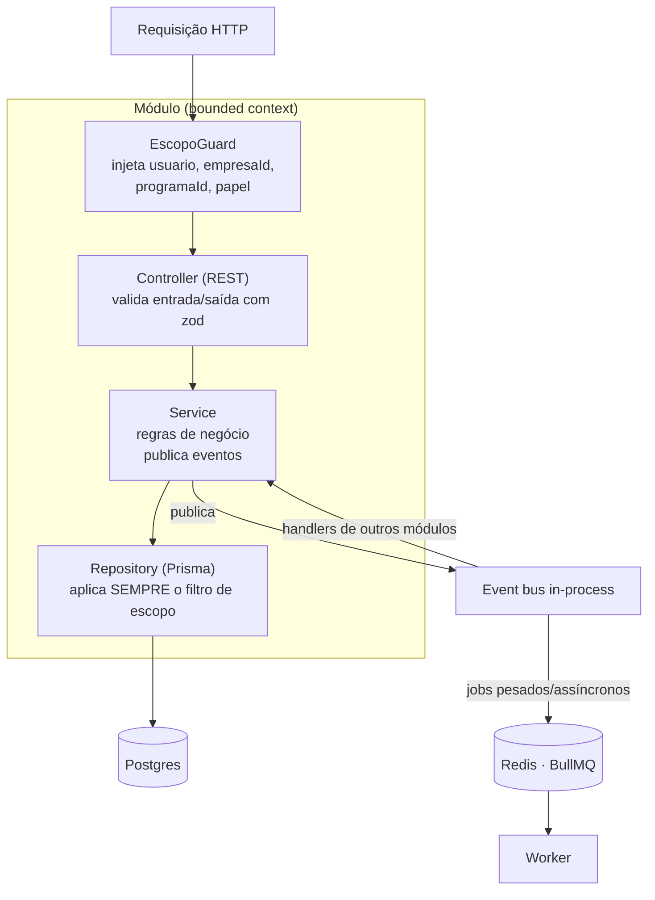
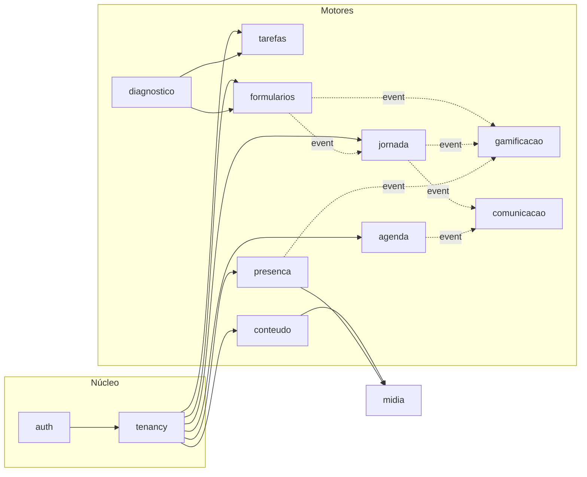

# Módulos da API

A API NestJS é organizada em **um módulo por bounded context**, espelhando os motores do
[modelo de domínio](arquitetura-dominio.md). Cada módulo é pequeno e substituível; eles
conversam por um **event bus de domínio**, não por chamadas diretas
([RC-1](requisitos.md#rc-1), [RC-4](requisitos.md#rc-4)).

## Camadas dentro de cada módulo

Todo módulo segue **Controller → Service → Repository**, com a autorização de escopo
centralizada num guard — nenhum id vindo do cliente é confiado sem o filtro
([RF-E1.6](requisitos.md#rf-e1-6), [RF-E1.7](requisitos.md#rf-e1-7), [RNF-2](requisitos.md#rnf-2)).

O `EscopoGuard` é a **exceção única** para o Admin, que transita entre empresas/programas;
para o Cliente, toda consulta é presa ao seu escopo ([RF-E1.7](requisitos.md#rf-e1-7),
[RF-E2.5](requisitos.md#rf-e2-5)). Entrada e saída são validadas com **zod**, e os DTOs são
compartilhados com o front no monorepo ([RNF-3](requisitos.md#rnf-3), [RNF-7](requisitos.md#rnf-7)).

## Mapa de módulos

As setas **cheias** são dependências de composição (o `diagnostico` reusa `formularios` e
`tarefas`); as **pontilhadas** são reações via event bus — o `gamificacao` nunca conhece a
`jornada`, só reage aos eventos dela ([RC-4](requisitos.md#rc-4)).

## Módulo → épico → eventos

| Módulo | Bounded context | Épico(s) | Publica | Consome |
|---|---|---|---|---|
| `auth` | Login, JWT, OAuth Google, sessão | E1 | — | — |
| `tenancy` | Empresa, Usuario, Produto, Programa, Participacao, escopo | E1, E2 | — | — |
| `tarefas` | Ciclos, tarefas, sementeira, templates de ciclo | E3 | — | — |
| `formularios` | Form builder, atribuição, respostas, quiz | E4 | `RespostaEnviada` | — |
| `agenda` | Disponibilidade, slots, sessões, registro | E5 | `SessaoAgendada`, `SessaoRealizada` | — |
| `conteudo` | Trilhas, itens, progresso | E6 | `ItemConcluido`, `TrilhaConcluida` | — |
| `jornada` | Jornada, etapas, progresso | E7 | `EtapaConcluida` | `RespostaEnviada`, `TrilhaConcluida` |
| `gamificacao` | Selos, critérios, concessão | E8 | `SeloConcedido` | `EtapaConcluida`, `TrilhaConcluida`, `PresencaRegistrada` |
| `comunicacao` | Modelos de mensagem, disparos, WhatsApp | E9 | — | `SessaoAgendada`, `EtapaConcluida` |
| `diagnostico` | Diagnóstico, resultado, plano de ação | E10 | — | `RespostaEnviada` |
| `presenca` | Eventos, check-in, certificados | E11 | `PresencaRegistrada` | — |
| `midia` | Upload/download S3 (MinIO), presigned URLs | transversal | — | — |

O catálogo detalhado de eventos e os jobs BullMQ que cada um dispara ficam na página de
**eventos e jobs** *(Fase B)*.

## Rastreabilidade

| Decisão de arquitetura | Requisito |
|---|---|
| Módulo por bounded context, Controller→Service→Repository | [RC-1](requisitos.md#rc-1), [RNF-7](requisitos.md#rnf-7) |
| EscopoGuard central; filtro em todo repositório | [RF-E1.6](requisitos.md#rf-e1-6), [RF-E1.7](requisitos.md#rf-e1-7), [RNF-2](requisitos.md#rnf-2) |
| RBAC por papel (Admin/Cliente) | [RF-E1.4a](requisitos.md#rf-e1-4a), [RNF-3](requisitos.md#rnf-3) |
| Comunicação por event bus; assíncrono no worker | [RC-4](requisitos.md#rc-4) |
| Configurabilidade sem deploy (builders como dado) | [RNF-1](requisitos.md#rnf-1) |
