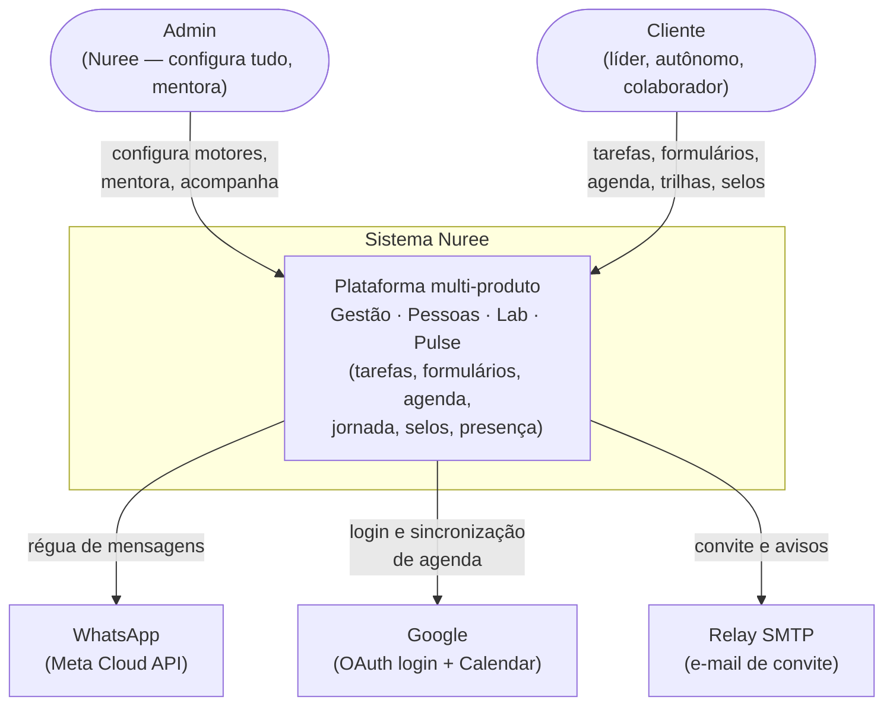
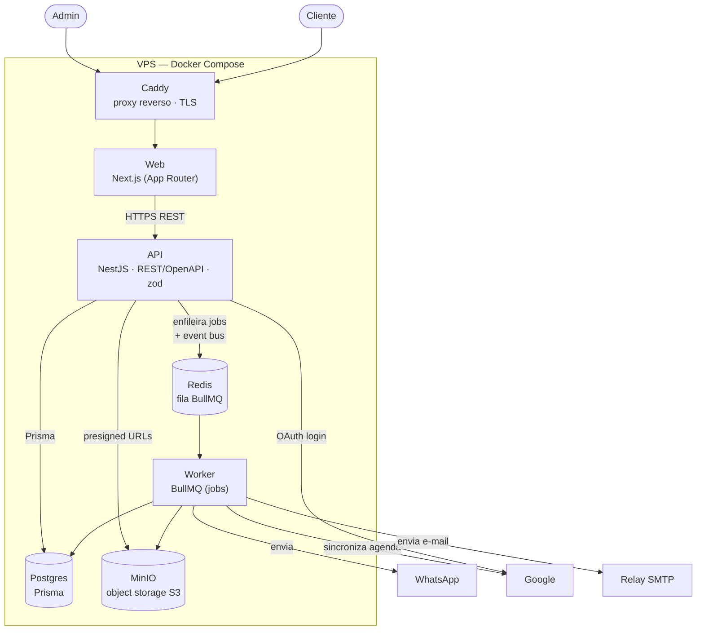

# Visão de arquitetura

Retrato de alto nível do sistema Nuree em dois níveis do modelo [C4](https://c4model.com/):
**contexto** (quem usa e com que sistemas externos falamos) e **contêineres** (as peças
que rodam e como conversam). Ancorado nas restrições de projeto [RC-1](requisitos.md#rc-1)..[RC-5](requisitos.md#rc-5)
e nos requisitos que cada peça atende.

Diagramas são código (Mermaid), não imagens — assim acompanham o sistema sem apodrecer.

## Nível 1 — Contexto

Só existem dois papéis de usuário: **Admin** (Helô e equipe Nuree; também é o mentor das
mentorias) e **Cliente** (líder, autônomo, colaborador). Não há Participante/Mentor/Gestor
como papéis separados — ver [RF-E1.4a](requisitos.md#rf-e1-4a).

| Elemento externo | Para quê | Requisitos |
|---|---|---|
| WhatsApp (Meta Cloud API) | Régua de comunicação automática antes/depois dos encontros | [RC-5](requisitos.md#rc-5), [RF-E9.1](requisitos.md#rf-e9-1)..[RF-E9.3](requisitos.md#rf-e9-3) |
| Google (OAuth) | Login complementar e vínculo de identidade | [RC-5](requisitos.md#rc-5), [RF-E1.8](requisitos.md#rf-e1-8), [RF-E1.9](requisitos.md#rf-e1-9) |
| Google (Calendar) | Criar eventos de sessão e ler ocupação do mentor | [RF-E5.8](requisitos.md#rf-e5-8)..[RF-E5.10](requisitos.md#rf-e5-10) |
| Relay SMTP | E-mail de convite ao criar usuário | [RF-E2.8](requisitos.md#rf-e2-8) |

## Nível 2 — Contêineres

A arquitetura decidida (ver ROADMAP §9 no repo app-nuree e RC-1..RC-4):
front Next.js consumindo uma **API dedicada NestJS** (REST/OpenAPI), com Postgres, Redis,
MinIO e um **worker** para o trabalho assíncrono, tudo em Docker Compose no VPS atrás do Caddy.

O **event bus de domínio** é in-process dentro da API (RC-4): os módulos publicam eventos e
handlers reagem no mesmo processo; o que é pesado/assíncrono (enviar WhatsApp, gerar PDF,
avaliar selos, sincronizar Calendar) é **enfileirado no Redis** e processado pelo **worker**.
O catálogo de eventos e jobs vem na página de eventos e jobs *(Fase B)*.

| Contêiner | Responsabilidade | Requisitos |
|---|---|---|
| Web (Next.js) | Interface; consome a API por REST | [RC-1](requisitos.md#rc-1), [RNF-5](requisitos.md#rnf-5), [RNF-6](requisitos.md#rnf-6) |
| API (NestJS) | Regras de negócio, autorização por escopo, event bus | [RC-1](requisitos.md#rc-1), [RC-4](requisitos.md#rc-4), [RNF-2](requisitos.md#rnf-2), [RNF-3](requisitos.md#rnf-3), [RNF-7](requisitos.md#rnf-7) |
| Worker (BullMQ) | Jobs duráveis e agendados (régua, lembretes, PDF, selos, sync) | [RC-4](requisitos.md#rc-4), [RF-E9.3](requisitos.md#rf-e9-3), [RF-E11.3](requisitos.md#rf-e11-3) |
| Postgres + Prisma | Persistência; escopo multi-tenant em toda consulta | [RC-2](requisitos.md#rc-2), [RNF-2](requisitos.md#rnf-2), [RNF-9](requisitos.md#rnf-9) |
| Redis + BullMQ | Fila de jobs com cron, delays e retries | [RC-2](requisitos.md#rc-2), [RC-4](requisitos.md#rc-4) |
| MinIO (S3) | Mídia (vídeos, pílulas, PDFs, avatares); código fala S3 desde o dia 1 | [RC-2](requisitos.md#rc-2), [RF-E6.2](requisitos.md#rf-e6-2), [RF-E11.3](requisitos.md#rf-e11-3) |
| Caddy | Proxy reverso e TLS automático | [RC-2](requisitos.md#rc-2) |

!!! note "Segurança e operação"
    A fronteira de segurança é a API: JWT access+refresh, RBAC por papel + escopo por
    empresa/programa, rate limiting, CORS restrito e validação zod ([RNF-3](requisitos.md#rnf-3)).
    Backups automáticos de banco e mídia com cópia off-site ([RNF-8](requisitos.md#rnf-8)) e
    soft delete global ([RNF-9](requisitos.md#rnf-9)) completam a base operacional.

## Próximas páginas

- [Modelo de domínio](arquitetura-dominio.md) — as classes de cada motor.
- [Modelo de banco](arquitetura-banco.md) — o ERD-alvo e as migrations propostas.
- [Módulos da API](arquitetura-modulos.md) — os bounded contexts e a autorização central.
