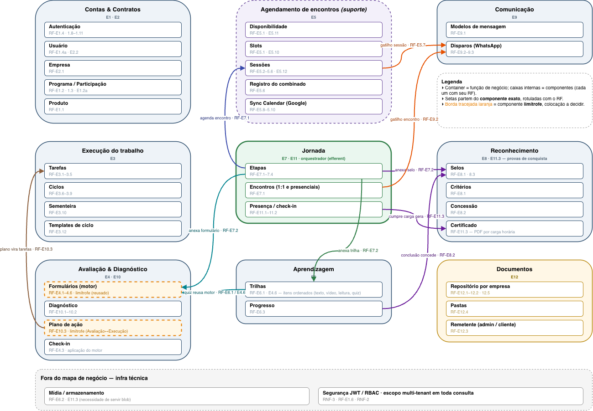
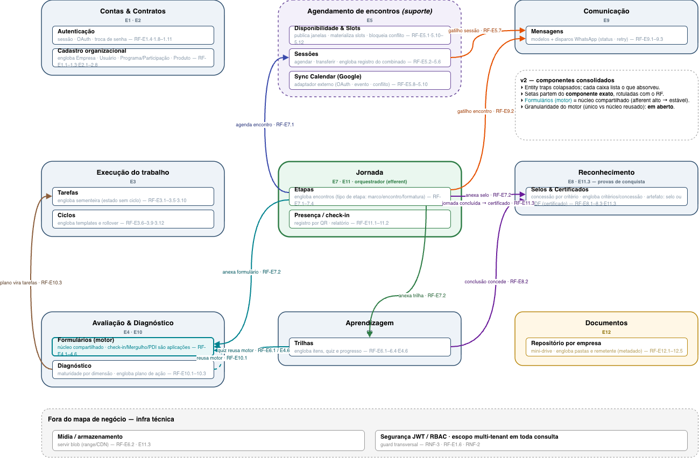

---
hide:
  - navigation
---

# Diagramas

Os diagramas do desenho. Dois são a **fonte da verdade**; dois ficam como **anti-patterns**, de
propósito. Detalhe textual em [Componentes](componentes.md); o porquê no
[diário](../../reunioes/exploracao-arquitetura-2026-08-02.md).

## Fonte da verdade

**Acoplamento** — os componentes e o que fala com o quê; foi daqui que o estilo se derivou.

**Topologia** — o estilo cravado (1 quantum + worker + infra).

## Anti-patterns

**v1 — *entity trap*.** Uma caixa por entidade; ainda sem o conceito de componente.

**v2 — serviços prematuros.** Componentes agrupados em serviços sem driver (solo dev, escala
rebaixada, acoplamento semântico).

## Relacionados

- [Componentes](componentes.md) · [Características](caracteristicas.md) · [Fitness functions](fitness-functions.md)
