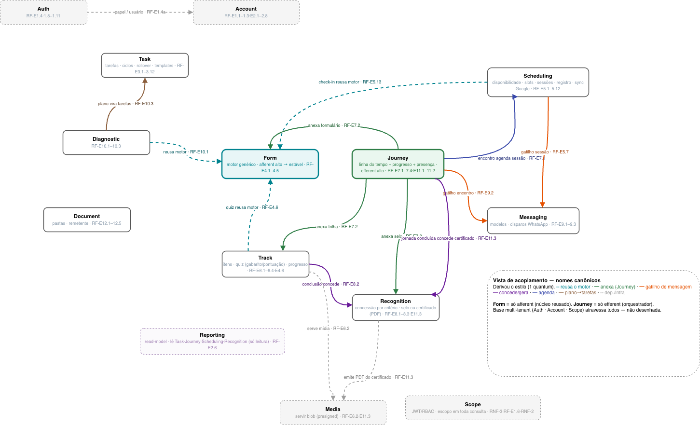
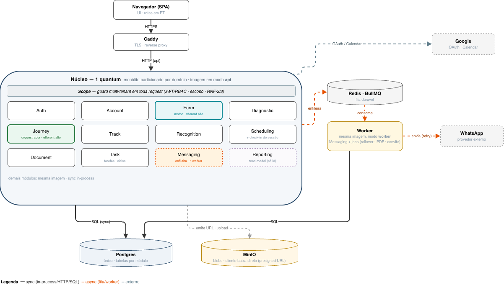

---
hide:
  - navigation
---

# Diagramas de arquitetura

O desenho de componentes do app-nuree. Dois diagramas são a **fonte da verdade atual**; dois
ficam preservados **de propósito como anti-patterns** — o registro do caminho até aqui, para não
repetir os erros. O raciocínio completo está no
[diário de exploração](../reunioes/exploracao-arquitetura-2026-08-02.md).

---

## Fonte da verdade (atual)

### Acoplamento de componentes

Os componentes (nomes canônicos) e o que fala com o quê — foi daqui que o **estilo** se derivou
(quem é afferent, quem é efferent, onde estão as fronteiras). Fonte: `componentes-flat.drawio`.

### Topologia (1 quantum)

O estilo cravado: **monólito particionado por domínio** — um único deployable (imagem em modo
`api` + `worker`), Postgres único com tabelas por módulo, `Messaging` na fila, `Media` por presigned
URL. Fonte: `topologia.drawio`.

Detalhe textual dos módulos, ações e eventos em [Componentes](componentes.md); os testes que
protegem estas decisões em [Fitness functions](fitness-functions.md).

---

## Anti-patterns (preservados de propósito)

### v1 — *entity trap*

A primeira tentativa: **uma caixa por entidade** (Usuário, Certificado, Remetente, Critérios,
Sementeira…). Na época eu ainda **não tinha o conceito do que é um componente** — confundi entidade
de dados com componente, e o mapa virou uma colcha de ~30 caixas sem responsabilidade clara. Fonte:
`componentes.drawio`.

### v2 — serviços prematuros

A segunda tentativa: agrupei os componentes em **serviços com múltiplos componentes**, forçando uma
topologia distribuída (service-based) **que não se justifica neste contexto** — solo dev, escala
rebaixada e alto acoplamento semântico. Era distribuir por hábito, sem driver. Fonte:
`componentes-v2.drawio`.

> **Por que guardar os erros:** o valor não está só no desenho final, mas em *por que* ele é o
> certo. v1 mostra o custo de não saber o que é um componente; v2, o custo de escolher uma
> arquitetura antes de os fatos a pedirem.
